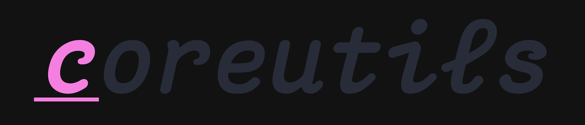
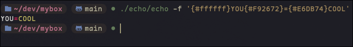
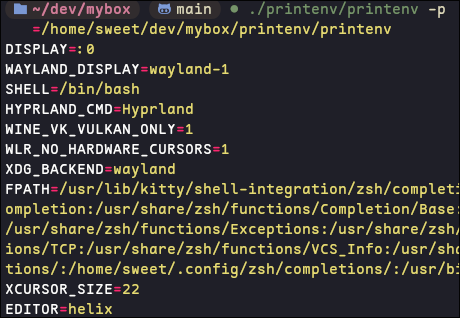

<p></p>
<p align="center">
  
</p>

Coreutils with a modern spin.
Why? Someone once said:
"If I cannot write it, then I do not understand it..."
and I took that to heart. This is purely for my entertainment and understanding of Unix systems,
if you want something battle tested, try: u-root, busybox, toybox, gnu coreutils or rust-coreutils.

## Examples
<p align="left">
  
</p>

echo support HEX colors with the `-f` switch
```bash
  ./echo -f '{#1e1e1e}HELLO{#clr}'
```

printenv has colored output
```bash
  ./printenv -p
```


## Installation
```sh
git clone https://github.com/sweetbbak/go-moreutils.git
cd go-moreutils

# from there you can cd into any of the commands directories and run:
git build
# or alternatively:
git run *.go [args]
# TODO add the justfile with options to build any tool or all tools at once
just
```
